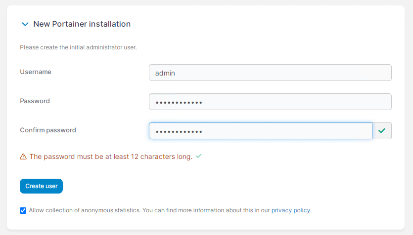
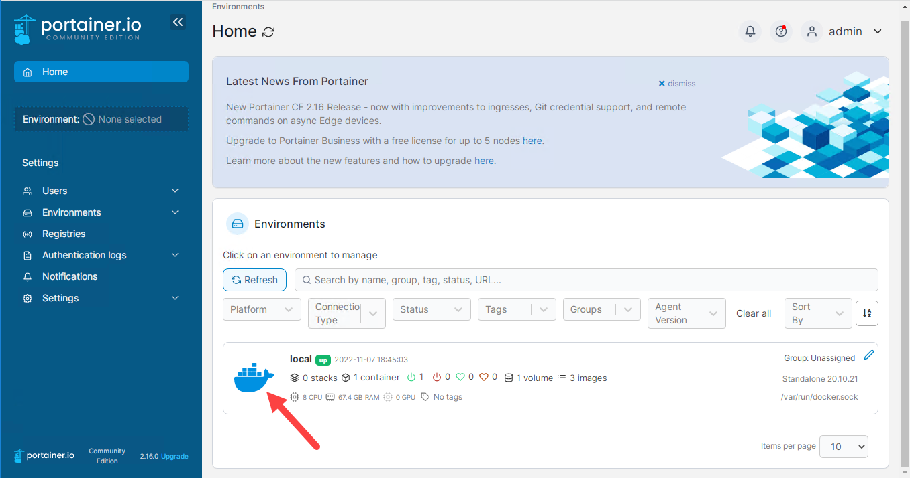
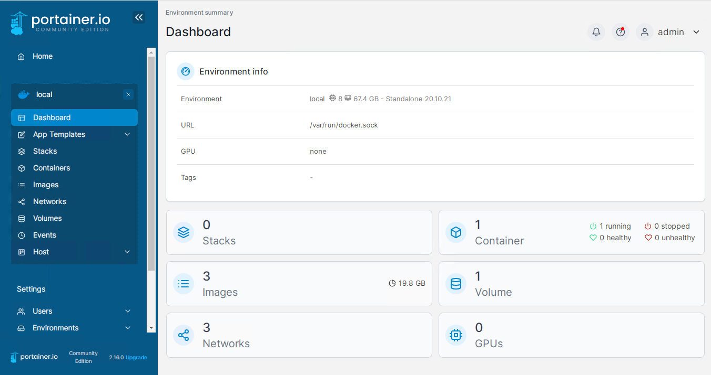
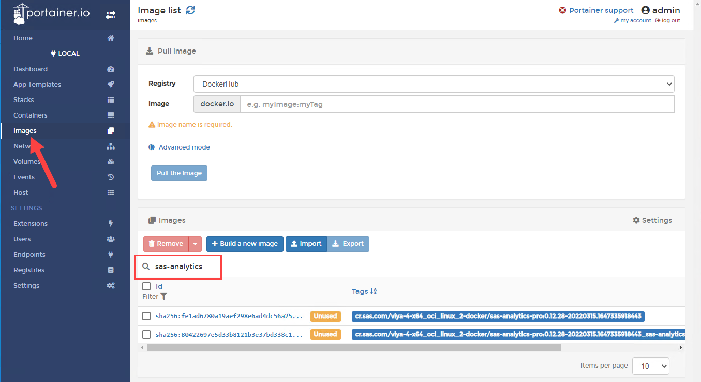
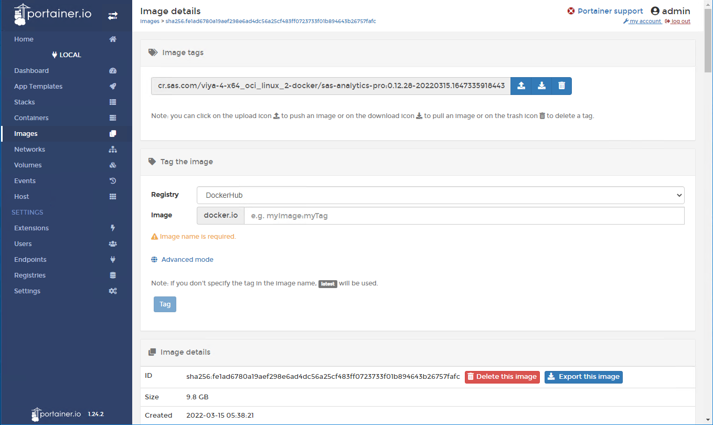
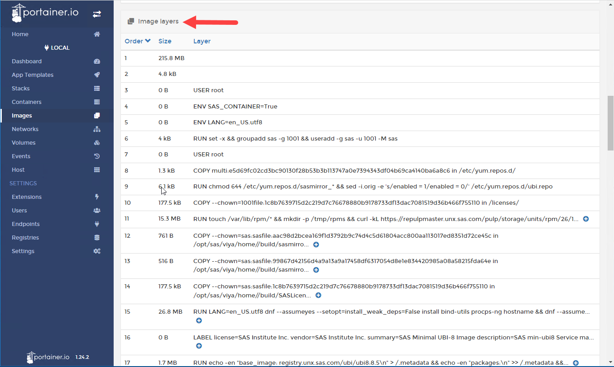

# Environment Set-up

- [Environment Set-up](#environment-set-up)
  - [Introduction](#introduction)
  - [Set-up working folders, License, Certificates, etc](#set-up-working-folders-license-certificates-etc)
  - [Download SAS Container Manager and PULL the Analytics Pro image](#download-sas-container-manager-and-pull-the-analytics-pro-image)
  - [Install Portainer](#install-portainer)
    - [Login to Portainer](#login-to-portainer)
    - [Use Portainer to view the Analytics Pro container](#use-portainer-to-view-the-analytics-pro-container)
  - [Next steps](#next-steps)
  - [Hands-on Navigation Index](#hands-on-navigation-index)

## Introduction

For this workshop we will use **SAS Analytics Pro Advanced Programming**. SAS Analytics Pro Advanced Programming first shipped in April 2022. In addition to the products provided with SAS Analytics Pro (Base SAS, SAS Studio, SAS/GRAPH, and SAS/STAT), Advanced Programming also includes the following products: SAS/ETS, SAS/IML, SAS/QC, and SAS/OR.

Reference material: [SAS Analytics Pro documentation](https://go.documentation.sas.com/doc/en/anprocdc/v_014/anprowlcm/home.htm)

From the Windows client start a MobaXterm session to the Linux server.

You can access the GitLab project from the Windows Client in your collection using the following link:

https://gelgitlab.race.sas.com/GEL/workshops/PSGEL317-sas-analytics-pro-deployment-and-configuration

## Set-up working folders, License, Certificates, etc

1. Make the working folder.

    ```bash
    mkdir -p ~/project/assets/
    mkdir -p ~/project/sasinside/
    mkdir -p ~/project/data/
    ```

1. Download the Certificates and License file from My SAS (my.sas.com).

    We have created a script that uses the Orders CLI to get the Analytics Pro license file and entitlement certificates. Run the following commands.

    ```bash
    code_dir=$HOME"/PSGEL317-sas-analytics-pro-deployment-and-configuration/scripts"
    # Run get_assets.sh <cadence name> <cadence version> or latest (to get n-1)
    bash ${code_dir}/get_assets.sh stable latest
    
    cd ~/project/assets/
    ls -al
    ```

    The assets folder should now have the required files. The output will be similar to the following for the current cadence version.

    ```log
    drwxr-xr-x 2 cloud-user docker    72 Jul 25 16:59 .
    drwxr-xr-x 5 cloud-user docker    49 Jul 25 16:50 ..
    -rw-r--r-- 1 cloud-user docker  4207 Jul 25 16:59 SASViyaV4_APro_certs.zip
    -rw-r--r-- 1 cloud-user docker 11993 Jul 25 16:59 SASViyaV4_APro_license.jwt
    ```

## Download SAS Container Manager and PULL the Analytics Pro image

As part of this workshop you will use the SAS Container Manager. In this exercise we will use it to pull the SAS Analytics Pro image from the SAS container registry (cr.sas.com).

1. Download SAS Container Manager and extract the files.

    ```bash
    CONTAINERMGR_URL=https://support.sas.com/installation/viya/4/sas-container-manager/lax/containermgr-linux.tgz
    wget ${CONTAINERMGR_URL} -O - | sudo tar -xz -C ~/project/
    ```

1. Use Container Manager to pull the Analytics Pro image.

    This will take a few minutes as the image is around 9.8GB.

    ```bash
    cd ~/project/
    ./container-manager install --deployment-data ~/project/assets/SASViyaV4_APro_certs.zip sas-analytics-pro
    ```

1. OPTIONAL. Confirm the image.

    Use the following docker command to list the images.

    ```bash
    docker image ls | grep sas-analytics-pro
    ```

## Install Portainer

Portainer is a useful tool to help you manage your docker environment. Rather than using the docker CLI, we can use Portainer. For more information see [portainer.io](https://www.portainer.io)

The next steps will guide you through the steps to pull the Portainer image and start an instance of Portainer on your Docker server.

1. Use the following command to download and run the Portainer image.

    ```bash
    docker container run \
      --name portainer \
      --restart always \
      -d -p 9000:9000 \
      -v /var/run/docker.sock:/var/run/docker.sock \
      -v portainer_data:/data \
      portainer/portainer
    ```

    As the Portainer image isn't on your docker server you will see a message that the image cannot be found and that it is being pulled to your server. Expand to see the sample output.

    You should see the following output.

    ```log
    Unable to find image 'portainer/portainer:latest' locally
    latest: Pulling from portainer/portainer
    94cfa856b2b1: Pull complete
    49d59ee0881a: Pull complete
    a2300fd28637: Pull complete
    Digest: sha256:fb45b43738646048a0a0cc74fcee2865b69efde857e710126084ee5de9be0f3f
    Status: Downloaded newer image for portainer/portainer:latest
    f1b3db82b1c5f130932d875c81757d205fe21454be460d3aebff3b24cc0d4d64
    ```

1. Confirm Portainer is running.

    Use the docker 'container ls' command to see the running containers on your Docker server.

    ```bash
    docker container ls | grep portainer
    ```

### Login to Portainer

Now that you have a running instance of Portainer you can login to it from the Windows client machine. Open a browser and access the following URL. Note, the port number has to be the one you specified when starting the container instance, in our case '9000'.

1. Use the following command to get your Portainer URL.

    ```bash
    echo "Portainer URL:         "http://$(hostname -f):9000/ | tee -a ~/urls.md
    ```

    * Note, there is a time-out period for the initial login to set the admin user password. If your environment has timed out you will see the following message.

        

        If you get this error switch back to the MobaXterm session and run the following command.

        ```sh
        CONTAINER_ID=$(docker container ls | grep portainer | awk '{ print $1 }')
        ## Restart the Portainer container
        docker container restart $CONTAINER_ID
        ```

    * Now switch back to the browser, you may have to hit refresh.

1. Login to Portainer

    On first login you will need to set a password for the administrator user (admin). With the latest releases of Portainer the password needs to be at least 12 characters.
    
    Use the following:

    * Username: **admin**
    * Password: **sasMetadata0** (with a zero)

    Enter the password and click '**Create user**', as shown in the image below.

    

1. Select '**Get Started**' from the Quick Setup page.

    

1. Connect to the Local docker environment.

    You now need to connect Portainer to your docker environment. To do this select the '**Local**' docker environment.

    

    You should now see the Portainer dashboard.

    

    Note, you will see that you already have multiple conatiners running. These were started as part of the Linux server build.

### Use Portainer to view the Analytics Pro container

1. Select the '**Images**' tab, and filter for sas-analytics-pro.

    

1. Select the first entry to see the details for the image.

    

1. If you scroll down you will see the image layers.

    **Q. How many layers can you see?**

    

---

## Next steps

That completes the base environment set-up. Now you can proceed to the next exercise, Deploying Analytics Pro.

  * [Quick-start deployment of Analytics Pro](./02_021_Quick-start_deployment_of_AnalyticsPro.md)

## Hands-on Navigation Index

<!-- startnav -->
* [01 Workshop Introduction / 01 011 Access Environments](/01_Workshop_Introduction/01_011_Access_Environments.md)
* [02 Deploy AnalyticsPro / 02 011 Environment setup](/02_Deploy_AnalyticsPro/02_011_Environment_setup.md)**<-- you are here**
* [02 Deploy AnalyticsPro / 02 021 Quick start deployment of AnalyticsPro](/02_Deploy_AnalyticsPro/02_021_Quick-start_deployment_of_AnalyticsPro.md)
* [03 Productionize the deployment / 03 015 Configure authentication and TLS security](/03_Productionize_the_deployment/03_015_Configure_authentication_and_TLS_security.md)
* [03 Productionize the deployment / 03 025 Advanced AnalyticsPro configuration](/03_Productionize_the_deployment/03_025_Advanced_AnalyticsPro_configuration.md)
* [03 Productionize the deployment / 03 031 Running multiple instances](/03_Productionize_the_deployment/03_031_Running_multiple_instances.md)
* [04 Using a CAS server / 04 011 Using a CAS server](/04_Using_a_CAS_server/04_011_Using_a_CAS_server.md)
* [05 Using Python with APro / 05 015 Using Python with AnalyticsPro](/05_Using_Python_with_APro/05_015_Using_Python_with_AnalyticsPro.md)
* [README](/README.md)
<!-- endnav -->
