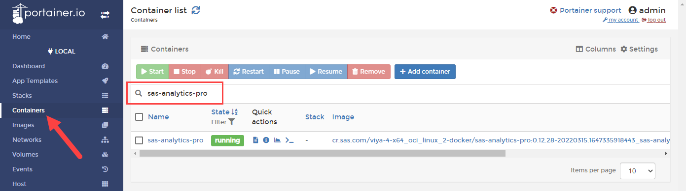
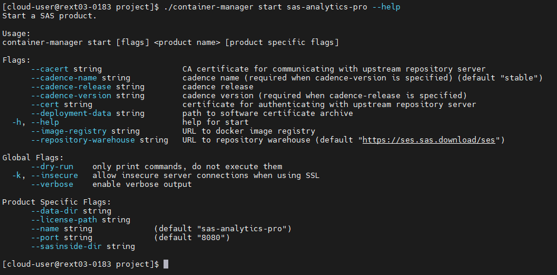
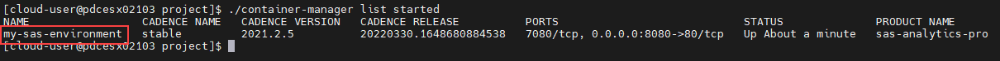
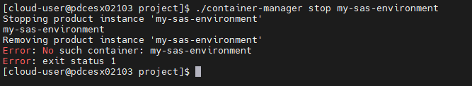
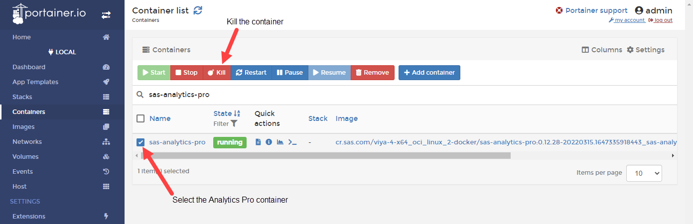
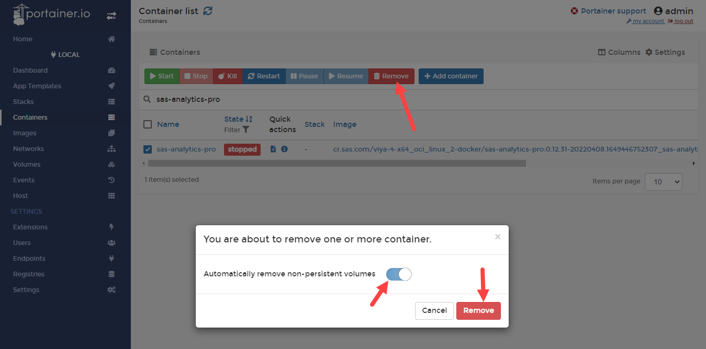

# Quick-start deployment of Analytics Pro

- [Quick-start deployment of Analytics Pro](#quick-start-deployment-of-analytics-pro)
  - [Start a default instance of Analytics Pro](#start-a-default-instance-of-analytics-pro)
    - [Optional: Using Portainer to view the running container](#optional-using-portainer-to-view-the-running-container)
  - [Using the Container Manager CLI](#using-the-container-manager-cli)
  - [Using the Docker run command to start Analytics Pro](#using-the-docker-run-command-to-start-analytics-pro)
  - [Using Protainer to Stop or Kill a running container](#using-protainer-to-stop-or-kill-a-running-container)
  - [Next steps](#next-steps)
  - [Hands-on Navigation Index](#hands-on-navigation-index)

## Start a default instance of Analytics Pro

In this first deployment exercise we will use the SAS Container Manager to perform a default Quick Start install. This is detailed in the Analytics Pro documentation: see [here](https://go.documentation.sas.com/doc/en/anprocdc/v_009/dplyviya0ctr/p19vjw0smdpog4n1qsrq3q98siqh.htm).

As you have already downloaded Container Manager and the SAS Analytics Pro image, you should have completed the steps in [02_011_Environment_setup](./02_011_Environment_setup.md), you are ready to start your first deployment of SAS Analytics Pro.

1. Start an instance of Analytics Pro.

    ```bash
    cd ~/project/
    ./container-manager start sas-analytics-pro \
      --license-path ~/project/assets/SASViyaV4_APro_license.jwt \
      --data-dir ~/project/data
    ```

1. Retrieve the password for the SAS demo user (sasdemo) from the '**authinfo.txt**' file.

    <!-- wait for cheatcodes
    sleep 1m
    -->

    ```bash
    sudo cat ~/project/data/authinfo.txt
    ```

1. Get the SAS Studio URL.

    ```bash
    echo "SAS Studio URL(http):  "http://$(hostname -f):8080/SASStudio | tee -a ~/urls.md
    ```

1. Login to SAS Studio using the 'sasdemo' user.

    Once in SAS Studio, you can start programming!

1. Let's do something simple, get the information on the SAS license.

    Open a new program tab, click on '**New SAS Program**' from the Start Page and 'run' the following to retrieve the license information.

    ```sh
    proc setinit;
    ```

    **Question time:** How many SAS/ACCESS products do you see?

    * A, 5
    * B, 10 to 15
    * C, 20
    * D, more than 20 SAS/ACCESS products.


### Optional: Using Portainer to view the running container

1. Login to Portainer.

    Use the following command to get the Portainer URL.

    ```sh
    cat ~/urls.md | grep Portainer
    ```

    The username is 'admin' and the password should be 'Metadata0', unless you set a different password for the admin user.

1. Select the 'Containers' tab, and filter on 'sas-analytics-pro'.

    

    You should now see the running instance of Analytics Pro.

    From here you can get information on the container, including the port mappings, volume mounts, and access to the container log file. You can even start a consule, exec into the container, to have a look around.

1. Select the 'sas-analytics-pro' container to view the details.

## Using the Container Manager CLI

The Container Manager can also be used to list and stop the running instances of Analytics Pro. As well as list any product specific flags for the Analytics Pro container. For example, using the **`container-manager start sas-analytics-pro --help`** command you will get the following output.



Let's try a few commands...

1. First, list the container-manager commands.

    ```bash
    cd ~/project
    ./container-manager --help
    ```

    You will see that we can not only use it to start Analytics Pro, but to stop, list and un-install a SAS product.

1. Confirm the cadence version of Analytics Pro.

    Use Container Manager to list the running instances of Analytics Pro. The details will show the Cadence Version.

    ```bash
    cd ~/project
    ./container-manager list started
    ```

    You should see output similar to the following.

    ```log
    NAME                CADENCE NAME   CADENCE VERSION   CADENCE RELEASE          PORTS                            STATUS          PRODUCT NAME        CONTAINER ID
    sas-analytics-pro   stable         2022.1.3          20220723.1658538455358   7080/tcp, 0.0.0.0:8080->80/tcp   Up 3 minutes   sas-analytics-pro   8d7d1a0534f1
    ```

1. Use Container Manager to stop Analytics Pro.

    ```sh
    cd ~/project
    ./container-manager stop sas-analytics-pro
    ```

    You should see the following output.

    ```log
    Stopping product instance 'sas-analytics-pro'
    sas-analytics-pro
    Removing product instance 'sas-analytics-pro'
    sas-analytics-pro
    ```

    If you use the list command again you shouldn't see any running instances now.

    If you are still logged into Portainer, you should also see that the running instance of Analaytics Pro has stopped. Refresh the 'Container list' page.

## Using the Docker run command to start Analytics Pro

Container Manager issued the 'docker run' command to start Analytics Pro for us. So, what did the docker command look like?

1. Copy the license file.

    To run the native docker command the license file has to be in the 'sasinside' folder. By default Analytics Pro is expecting the license key file to be called `license.sas`.

    ```bash
    cd ~/project/assets/
    cp *.jwt ~/project/sasinside/license.sas
    ```

1. The following docker command will also start an instance of Analytics Pro using the default user (sasdemo).

    ***Make sure you have stopped Analytics Pro before running the 'docker run' command***.

    ```sh
    cd ~/project/
    # Get the Analytics Pro image name
    APRO_IMAGE=$(docker image ls | grep -m 1 sas-analytics-pro | awk '{ print $1 ":" $2 }')

    docker run -u root \
    --name=sas-analytics-pro \
    --rm \
    --detach \
    --hostname sas-analytics-pro \
    --env RUN_MODE=developer \
    --publish 8080:80 \
    --volume ${PWD}/sasinside:/sasinside \
    --volume ${PWD}/data:/data \
    $APRO_IMAGE
    ```

    You can see that the '--env RUN_MODE=developer' environment variable has been set. This runs Analytics Pro in developer mode, using the default user (sasdemo), without the need to configure an authentication provider.

    If you want to login to this instance of Analytics Pro you will need to get the new password for the sasdemo user.

   * Retrieve the password for the SAS demo user (sasdemo) from the authinfo.txt file.

       ```sh
       sudo cat ~/project/data/authinfo.txt
       ```

   * Use the following command to get the saved URL for SAS Studio.

       ```sh
       cat ~/urls.md
       ```

   * Login with the sasdemo user, using the new password.

1. Confirm the running instance, using a Docker command.

    At this point you could use a docker command to list the running conatiners. Run the following command.

    ```sh
    docker container list | grep sas-analytics-pro
    ```

    Note, the docker command doesn't show any of the Analytics Pro cadence information, it just shows the information available to Docker.

1. Confirm the running instance using SAS Container Manager.

    ```sh
    cd ~/project
    ./container-manager list started
    ```

    While Container Manager will list the running instances regardless of the name (--name) or hostname (--hostname) that you have set on the Docker Run command.

    To stop an instance of Analytics Pro you have to specify the name used on the '--name' tag.

    Let's test this out.

1. Stop the running instance of Analytics Pro.

    * You can do this using the following Docker command.

        ```sh
        # Get the container ID
        CONTAINER_ID=$(docker container ls | grep sas-analytics-pro | awk '{ print $1 }')
        # Kill the running container
        docker container kill $CONTAINER_ID
        ```

    * Or, use Container Manager.

        ```sh
        cd ~/project
        ./container-manager stop sas-analytics-pro
        ```

1. Start a new Analytics Pro container using different names.

    For this you will set the container name to '**my-sas-environment**' and the container hostname to '**my-apro-host**'. Use the following command.

    ```sh
    cd ~/project/
    # Get the Analytics Pro image name
    APRO_IMAGE=$(docker image ls | grep -m 1 sas-analytics-pro | awk '{ print $1 ":" $2 }')

    docker run -u root \
    --name=my-sas-environment \
    --rm \
    --detach \
    --hostname my-apro-host \
    --env RUN_MODE=developer \
    --publish 8080:80 \
    --volume ${PWD}/sasinside:/sasinside \
    --volume ${PWD}/data:/data \
    $APRO_IMAGE
    ```

1. Use Container Manager to list the running container.

    ```sh
    cd ~/project
    ./container-manager list started
    ```

    You should now see that the name has been set to 'my-sas-environment'. Your output will be similar to the following.

    

    The output from the container-manager command doesn't show the container hostname, so you have to use the `docker exec` command to retrieve this. Try it now, run the the following to confirm that the hostname has been set to 'my-apro-host'.

    ```sh
    # docker exec <container_name> <command>
    docker exec my-sas-environment hostname 
    ```

1. Now try and stop the container using the original command.

    ```sh
    cd ~/project
    ./container-manager stop sas-analytics-pro
    ```

    You will see that this doesn't work.

1. Now, try using the hostname that you set (my-apro-host).

    ```sh
    cd ~/project
    ./container-manager stop my-apro-host
    ```

    Again, you should get the error message, this time "Error: Product 'my-apro-host' not found".

1. Stop the container using the new container name.

    ```sh
    cd ~/project
    ./container-manager stop my-sas-environment
    ```

    You should see the following output. *Note, the error shown below is from a post stop check to confirm that the container instance, in this case 'my-sas-environment', has been stopped*.

    

## Using Protainer to Stop or Kill a running container

It is also possible to use Portainer to Stop or Kill a running container, from the 'Container list' page. For example, to kill '**sas-analytics-pro**'.



If you end up with a container in a stopped state you can use Portainer to remove it. Or using the docker command line issue the `docker rm -v sas-analytics-pro` command.



---

## Next steps

That completes the base exercises to get SAS Analytics Pro running. In the next set of exercises we will investigate advanced configurations. Proceed to the exercises to "productionize" the SAS Analytics Pro deployment.

  * [Configure Authentication and TLS Security](./../03_Productionize_the_deployment/03_015_Configure_authentication_and_TLS_security.md)

## Hands-on Navigation Index

<!-- startnav -->
* [01 Workshop Introduction / 01 011 Access Environments](/01_Workshop_Introduction/01_011_Access_Environments.md)
* [02 Deploy AnalyticsPro / 02 011 Environment setup](/02_Deploy_AnalyticsPro/02_011_Environment_setup.md)
* [02 Deploy AnalyticsPro / 02 021 Quick start deployment of AnalyticsPro](/02_Deploy_AnalyticsPro/02_021_Quick-start_deployment_of_AnalyticsPro.md)**<-- you are here**
* [03 Productionize the deployment / 03 015 Configure authentication and TLS security](/03_Productionize_the_deployment/03_015_Configure_authentication_and_TLS_security.md)
* [03 Productionize the deployment / 03 025 Advanced AnalyticsPro configuration](/03_Productionize_the_deployment/03_025_Advanced_AnalyticsPro_configuration.md)
* [03 Productionize the deployment / 03 031 Running multiple instances](/03_Productionize_the_deployment/03_031_Running_multiple_instances.md)
* [04 Using a CAS server / 04 011 Using a CAS server](/04_Using_a_CAS_server/04_011_Using_a_CAS_server.md)
* [05 Using Python with APro / 05 015 Using Python with AnalyticsPro](/05_Using_Python_with_APro/05_015_Using_Python_with_AnalyticsPro.md)
* [README](/README.md)
<!-- endnav -->


