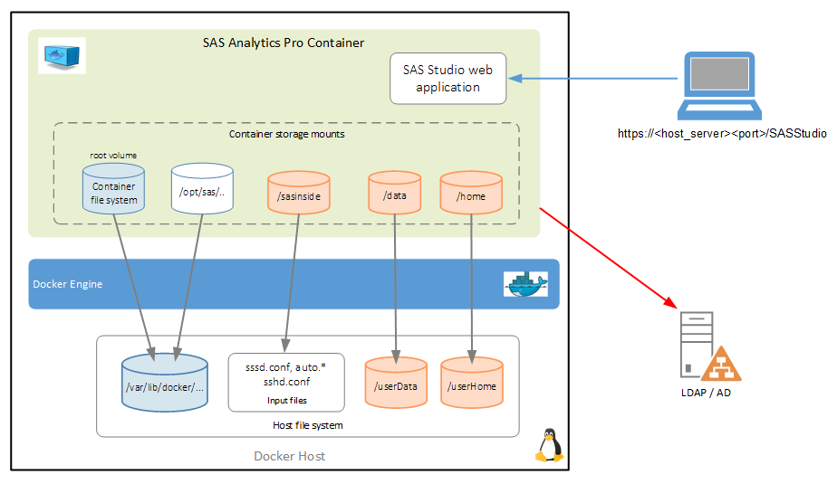
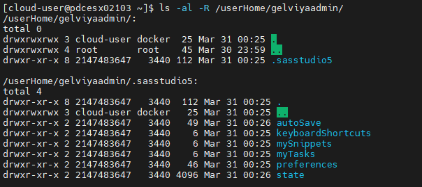
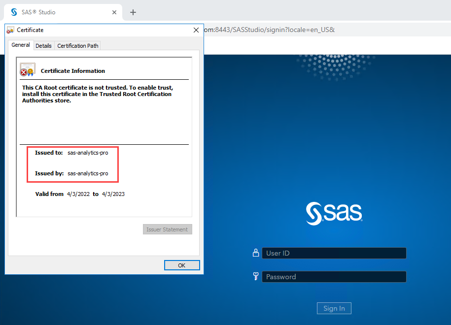
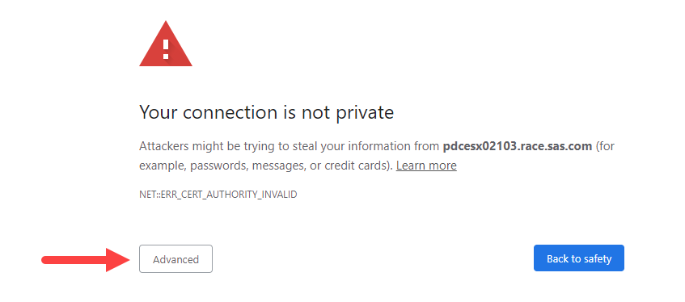
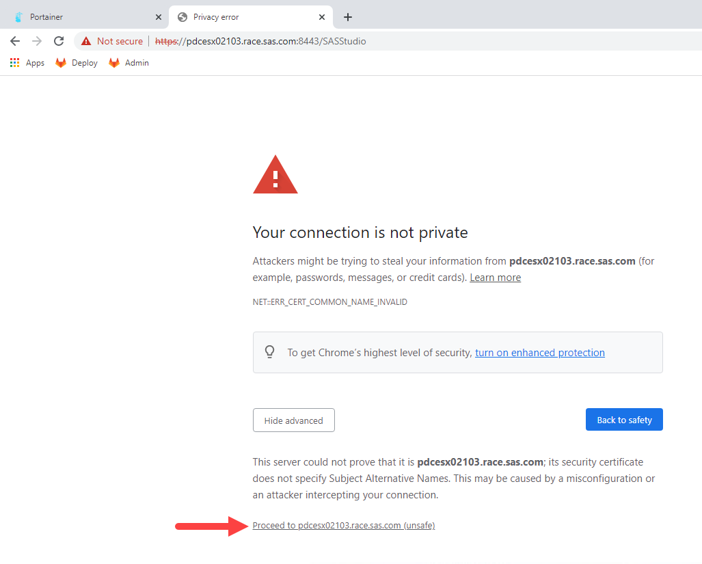
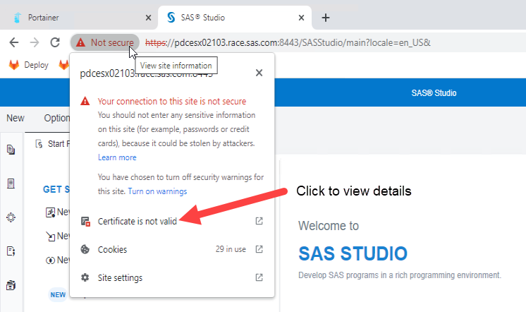
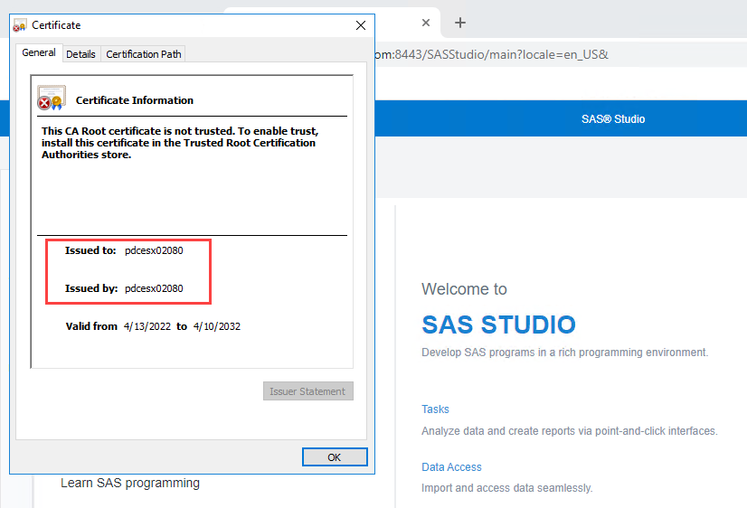

# Configure Authentication and TLS Security

- [Configure Authentication and TLS Security](#configure-authentication-and-tls-security)
  - [Introduction](#introduction)
  - [Create the users and home folders](#create-the-users-and-home-folders)
  - [Configure Authentication](#configure-authentication)
    - [Create the SSSD file](#create-the-sssd-file)
    - [Start Analytics Pro](#start-analytics-pro)
    - [Validate the Configuration](#validate-the-configuration)
  - [Configure TLS security](#configure-tls-security)
    - [Validate the TLS Configuration](#validate-the-tls-configuration)
  - [Next steps](#next-steps)
  - [Hands-on Navigation Index](#hands-on-navigation-index)

## Introduction

In this exercise we will simulate a production configuration by enabling authentication to an AD server. For this we will use the GEL RACE AD server.

While it isn’t mandatory to have the Docker host configured for SSSD to authenticate to the provider being used by the Analytics Pro container, it WILL definitely make your life easier. Especially, if using local storage volumes for the /home and any file system data access. As you will be!

***It is also important to note that Analytics Pro will not create the user’s /home folder, this needs to be already defined***.

As the Docker (Linux) server hasn't been configured for SSSD to the GEL RACE AD domain, we need to set-up the users locally. To ensure that processes like creating the '.sasstudio5' folder and '.authinfo' file work correctly, the UID and GID for the local users has to match the AD user definitions.

For this exercise we will use the following configuration.



## Create the users and home folders

In real life the data and user home folders would most likely be on a network fileshare, but we will use the storage on the Docker Server.

Therefore, as described above, some set-up is required.

1. Create the local users.

    You will set-up the following users: 'gelviyaadmin' and 'gatedemo001' to 'gatedemo003'.

    ```bash
    # Run create_user_home.sh
    bash ~/PSGEL317-sas-analytics-pro-deployment-and-configuration/scripts/create_users.sh
    ```

1. Confirm that the user home folders have been created. At this point they will be empty of any content.

    ```bash
    sudo ls -al -R /userHome/
    ```

## Configure Authentication

### Create the SSSD file

1. Make the configuration folder.

    Any files used to configure the operating system are placed in the `sasinside/sasosconfig` folder. Create the folder.

    ```bash
    mkdir -p ~/project/sasinside/sasosconfig
    ```

1. Create the `sssd.conf` file for the GEL RACE AD server.

    ```bash
    cd ~/project/
    cat << 'EOF' > ~/project/sasinside/sasosconfig/sssd.conf
    [sssd]
    config_file_version = 2
    services = nss,pam
    sbus_timeout = 30
    domains = RACE.SAS.COM

    [domain/RACE.SAS.COM]
    enumerate = false
    cache_credentials = true
    ignore_group_members = true
    id_provider = ldap
    auth_provider = ldap
    chpass_provider = ldap

    ldap_uri = ldap://race.sas.com:389
    ldap_schema = rfc2307bis

    ldap_user_object_class = user
    #ldap_user_home_directory = unixHomeDirectory
    ldap_user_home_directory = /home/%u
    ldap_user_principal = sAMAccountName
    ldap_user_name = sAMAccountName
    ldap_group_object_class = group
    ldap_access_order = expire
    ldap_account_expire_policy = ad
    ldap_force_upper_case_realm = true
    ldap_referrals = false
    ldap_user_search_base = OU=Users,OU=STIC,DC=race,DC=sas,DC=com
    ldap_default_bind_dn = CN=GEL Viya LDAP,OU=Users,OU=STIC,DC=race,DC=sas,DC=com
    ldap_default_authtok_type = password
    ldap_default_authtok = P@ssw0rd
    ldap_id_use_start_tls = true
    ldap_tls_reqcert = demand
    #ldap_tls_cacert = /etc/ssl/certs/sssd

    ldap_use_tokengroups = true

    #fallback_homedir = /home/%u

    # override the user home directory that is provided by the LDAP password entry
    override_homedir = /home/%u

    # override the user shell that is provided by the LDAP password entry
    override_shell = /bin/bash

    [nss]
    filter_users = root
    filter_groups = root
    EOF
    ```

### Start Analytics Pro

We could use the Container Manager but lets first use the native docker commands.

1. Stop any running instance of Analytics Pro.

    <!-- ADDED FOR CHEAT-CODES
    ```bash
    CONTAINER_ID=$(docker container ls | grep sas-analytics-pro | awk '{ print $1 }')
    docker container stop $CONTAINER_ID
    docker container rm $CONTAINER_ID
    ```
    -->

    ```bash
    # Stop any running instance of Analytics Pro
    ## Get the container ID
    CONTAINER_ID=$(docker container ls | grep sas-analytics-pro | awk '{ print $1 }')
    ## Kill the running container
    docker container kill $CONTAINER_ID
    ```

1. Copy the SAS License.

    By default Analytics Pro is expecting the license key file called `license.sas` in the 'sasinside' folder. But this can be overridden by setting an environment variable.

    ```bash
    cd ~/project/assets/
    #cp *.jwt ~/project/sasinside/license.sas
    cp *.jwt ~/project/sasinside/
    ```

1. Start Analytics Pro.

    For this we will set the `--env SASLICENSEFILE` environment variable to pick up the name of your license file.

    ```sh
    cd ~/project/
    # Get the Analytics Pro image name
    APRO_IMAGE=$(docker image ls | grep -m 1 sas-analytics-pro | awk '{ print $1 ":" $2 }')

    docker run -u root \
    --name=sas-analytics-pro \
    --rm \
    --detach \
    --hostname sas-analytics-pro \
    --env SASLICENSEFILE=SASViyaV4_APro_license.jwt \
    --publish 8080:80 \
    --volume ${PWD}/sasinside:/sasinside \
    --volume /userHome:/home \
    $APRO_IMAGE
    ```

### Validate the Configuration

1. Check the file system mounts.

    Exec into the container to check that the mounts have worked.

    ```sh
    docker exec -u=root -it sas-analytics-pro ls -al /home
    ```

1. Login to SAS Studio

    Now login to SAS Studio (Analytics Pro) using a domain user rather than using 'sasdemo'. There are a number of users defined in the GEL RACE AD, for this step we will use the 'gelviyaadmin' user.

    Username: **gelviyaadmin**

    Password: **P@ssw0rd** (with a zero)

    * Get the SAS Studio URL.

        ```sh
        cat ~/urls.md | grep "SAS Studio"
        ```

1. Exit SAS Studio when you have finished.

1. Confirm that the required folders and files have been created for the 'gelviyaadmin' user, using the new user home location.

    ```sh
    sudo ls -al -R /userHome/gelviyaadmin/
    ```

    You should now see that a set of folders and files have been created for the 'gelviyaadmin' user. The start of the output will be similar to the following.

    

## Configure TLS security

By default TLS security is enabled using a self-signed certificate that is generated by Analytics Pro. To enable the default TLS access to SAS Studio it is as simple as mapping port '443' (**--publish 8443:443**).

*Note, you could expose any port. In the example I have used port '8443' to be mapped to port 443 in the container*. We will look at using different ports in exercise: [03_031 Running Multiple Instances of SAS Analytics Pro](./../03_Productionize_the_deployment/03_031_Running_multiple_instances.md).

For example, the following command can be used if you would like to test this out.

* Enabling TLS access to SAS Studio.

    ```sh
    # Stop any running instance of Analytics Pro
    # Get the container ID
    CONTAINER_ID=$(docker container ls | grep sas-analytics-pro | awk '{ print $1 }')
    # Kill the running container
    docker container kill $CONTAINER_ID

    cd ~/project/
    # Get the Analytics Pro image name
    APRO_IMAGE=$(docker image ls | grep -m 1 sas-analytics-pro | awk '{ print $1 ":" $2 }')

    docker run -u root \
    --name=sas-analytics-pro \
    --rm \
    --detach \
    --hostname sas-analytics-pro \
    --env SASLICENSEFILE=SASViyaV4_APro_license.jwt \
    --publish 8443:443 \
    --volume ${PWD}/sasinside:/sasinside \
    --volume /userHome:/home \
    $APRO_IMAGE
    ```

* Get the new (HTTPS) URL for SAS Studio.

    ```sh
    echo "SAS Studio URL(https): "https://$(hostname -f):8443/SASStudio | tee -a ~/urls.md
    ```

* Login to SAS Studio using the HTTPS (TLS) connection.


* View the certificate information

    If you view the certificate details you will see that you are using a generated certificate. See below.

    

At this point, if you access SAS Studio by using HTTPS with the generated certificate you will get warnings. To avoid the warning message you should use a Transport Layer Security (TLS) certificate that is signed by an official certificate authority.

You would use the customer provided certificate, that has been signed by an official certificate authority.

To do this, set the **SSL_CERT_NAME** and **SSL_KEY_NAME** environment variables so that SAS Analytics Pro recognizes the signed certificate file and the private key file. These files must reside within the `sasinside/sasosconfig` directory.

The following steps will guide you through the setup. For this we will create a server certificate and key. Note, as the certificate is self-signed you will still see the Browser warning messages.

1. Create a working folder.

    ```bash
    mkdir -p ~/project/working/
    ```

1. Create the input file required to create the certificates.

    ```bash
    cd ~/project/working/
    server_name=$(hostname)
    server_fqdn=$(hostname -f)

    bash -c "cat << 'EOF' > ~/project/working/req.conf
    [req]
    distinguished_name = req_distinguished_name
    x509_extensions = v3_req
    prompt = no
    [req_distinguished_name]
    C = US
    ST = NC
    L = Cary
    O = SAS
    OU = GEL
    CN = ${server_name}
    [v3_req]
    basicConstraints=CA:TRUE
    keyUsage = keyEncipherment, dataEncipherment, keyCertSign, digitalSignature
    extendedKeyUsage = serverAuth
    subjectAltName = @alt_names
    [alt_names]
    DNS.1 = localhost
    DNS.2 = ${server_name}
    DNS.3 = ${server_fqdn}
    EOF"
    ```

1. Create the self-signed certificate and public key using the input file you have just created.

    ```bash
    cd ~/project/working/
    openssl req -x509 -nodes -days 3650 -newkey rsa:2048 -keyout servertls.key -out casigned.crt -config req.conf -extensions 'v3_req'
    ```

1. You can check the result using the following command.

    ```sh
    openssl x509 -text -noout -in casigned.crt
    ```

1. Copy the certificate and key to the `sasinside/sasosconfig` directory.

    ```bash
    cp ~/project/working/casigned.crt ~/project/sasinside/sasosconfig/
    cp ~/project/working/servertls.key ~/project/sasinside/sasosconfig/
    ```

1. Before you start Analytics Pro you need to stop any running instance.

    Do this using the 'docker container kill' command.

    ```bash
    # Get the container ID
    CONTAINER_ID=$(docker container ls | grep sas-analytics-pro | awk '{ print $1 }')
    # Kill the running container
    docker container kill $CONTAINER_ID
    ```

    <!-- Wait for cheatcodes
    sleep 30s
    -->

1. Start Analytics Pro using the TLS configuration.

    This time we need to map port 443. You will use port 8443 as the external port to access the container.

    ```bash
    cd ~/project/
    # Get the Analytics Pro image name
    APRO_IMAGE=$(docker image ls | grep -m 1 sas-analytics-pro | awk '{ print $1 ":" $2 }')

    docker run -u root \
    --name=sas-analytics-pro \
    --rm \
    --detach \
    --hostname sas-analytics-pro \
    --env SASLICENSEFILE=SASViyaV4_APro_license.jwt \
    --env SSL_CERT_NAME=casigned.crt \
    --env SSL_KEY_NAME=servertls.key \
    --publish 8443:443 \
    --volume ${PWD}/sasinside:/sasinside \
    --volume /userHome:/home \
    $APRO_IMAGE
    ```

### Validate the TLS Configuration

1. Get the HTTPS URL for SAS Studio.

    ```bash
    echo "SAS Studio URL(https): "https://$(hostname -f):8443/SASStudio

    #or

    cat ~/urls.md | grep "(https)"
    ```

1. Login to SAS Studio using the HTTPS (TLS) connection.

    Note, while we have used the GEL Certificates they are not signed by a certificate authority so you will still get the privacy warnings.

    * Click on 'Advanced' to proceed.

      

    * Click on the 'proceed' link.

      

    * Username: **gelviyaadmin**
    * Password: **P@ssw0rd** (with a zero)

1. View the TLS certificate.

    Once you have a session with Analytics Pro you can view the certificate details. Note, you don't have to be logged into SAS Studio to do this.

    Click on the **site information**.

    

    Now click on '**Certificate is not valid**'.

    

    You should see that we are now using the server certificate.

1. Now try to login using the HTTP port.

    Get the HTTP URL.

    ```sh
    cat ~/urls.md | grep "(http)"
    ```

    **Question time:** What happens if you try and login using the http port?

    Why did you get that error?

    As we didn't map the HTTP (80) port you will get the "**This site can't be reached**" page.

## Next steps

The completes the steps to set-up authentication and TLS encryption. Now proceed to the Analytics Pro configuration updates.

  * [Analytics Pro advanced configuration](./../03_Productionize_the_deployment/03_025_Advanced_AnalyticsPro_configuration.md)

## Hands-on Navigation Index

<!-- startnav -->
* [01 Workshop Introduction / 01 011 Access Environments](/01_Workshop_Introduction/01_011_Access_Environments.md)
* [02 Deploy AnalyticsPro / 02 011 Environment setup](/02_Deploy_AnalyticsPro/02_011_Environment_setup.md)
* [02 Deploy AnalyticsPro / 02 021 Quick start deployment of AnalyticsPro](/02_Deploy_AnalyticsPro/02_021_Quick-start_deployment_of_AnalyticsPro.md)
* [03 Productionize the deployment / 03 015 Configure authentication and TLS security](/03_Productionize_the_deployment/03_015_Configure_authentication_and_TLS_security.md)**<-- you are here**
* [03 Productionize the deployment / 03 025 Advanced AnalyticsPro configuration](/03_Productionize_the_deployment/03_025_Advanced_AnalyticsPro_configuration.md)
* [03 Productionize the deployment / 03 031 Running multiple instances](/03_Productionize_the_deployment/03_031_Running_multiple_instances.md)
* [04 Using a CAS server / 04 011 Using a CAS server](/04_Using_a_CAS_server/04_011_Using_a_CAS_server.md)
* [05 Using Python with APro / 05 015 Using Python with AnalyticsPro](/05_Using_Python_with_APro/05_015_Using_Python_with_AnalyticsPro.md)
* [README](/README.md)
<!-- endnav -->


