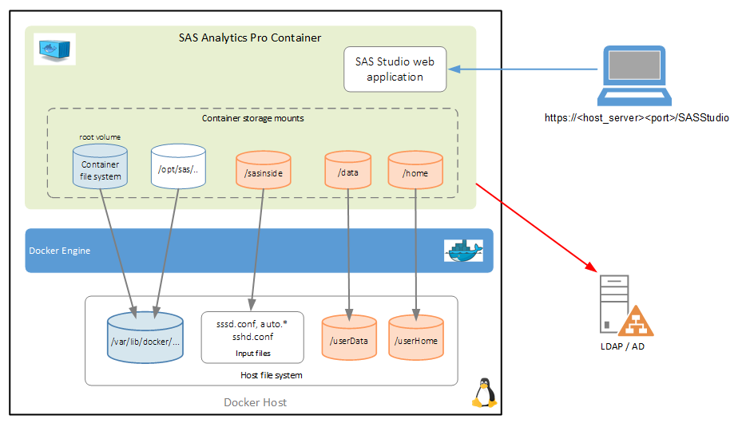

# Advanced Analytics Pro Configuration

- [Advanced Analytics Pro Configuration](#advanced-analytics-pro-configuration)
  - [Introduction](#introduction)
  - [Adding the Business Data](#adding-the-business-data)
  - [Set new locations for the Work Library and Utility files](#set-new-locations-for-the-work-library-and-utility-files)
    - [Confirm the new configuration](#confirm-the-new-configuration)
      - [UTILLOC testing](#utilloc-testing)
  - [Next steps](#next-steps)
  - [Hands-on Navigation Index](#hands-on-navigation-index)

## Introduction

The configuration of the Analytics Pro environment can be controlled through the following modification (configuration) files:

* autoexec_usermods.sas
* sasv9_usermods.cfg
* batchserver_usermods.sh
* workspaceserver_usermods.sh
* init_usermods.properties
* spawner_usermods.sh
* sasstudio_usermods.conf (Basic version)

For information on the configuration options for each of these files see the SAS 9 and SAS Viya 3 documentation.

In this workshop we will not look at all these files. We will start exploring updating the file and folder (path) access list. We will configure access to the business data.

Once again, for this exercise we will use the following configuration.



The following exercises build on the configuration created in the previous lab exercise: [03_015 Configure Authentication and TLS Security](./03_015_Configure_authentication_and_TLS_security.md).

## Adding the Business Data

Analytics Pro ships with a number of access engines, you can see the complete list by logging into SAS Studio and running the 'setinit' procedure.

```sh
proc setinit;
```

However, what if the SAS datasets and other files are located on a file share or on the Docker server? It is not just a case of having the volume mounted to the Docker server, it must also be mounted to the Analytics Pro container and visible to Analytics Pro.

For this exercise you will set-up a '/userDate' folder and mount this to the Analytics Pro container. For example, using the volume statement on the docker run command, `--volume /userData:/data`. This mounts the local '/userData' as '/data' within the container.

1. Create a root folder for user data.

    ```bash
    # Create the root folder for user Data
    sudo mkdir -p /userData/
    ```

1. Now that you have a data folder, let's copy a few files into the folder.

    ```bash
    sudo cp ~/PSGEL317-sas-analytics-pro-deployment-and-configuration/files/* \
    /userData/

    # Set the permissions on the folder and files (open to all users)
    sudo chmod 777 -R /userData/
    ```

The final part of the configuration is due to the Analytics Pro container running in LOCKDOWN mode. If you try to create a new file shortcut or library to '/data' you will get the following error message.


You could disable the locked-down state, add the following line to the launch script or Docker run command (-e SASLOCKDOWN=0). But that is a very insecure set-up. So, let's not do that!

Therefore, to fix this we need to add the '/data' path to the accessible path list. You do this using the `autoexec_usermods.sas` configuration.

3. Create the 'autoexec_usermods.sas' file in the /sasinside folder.

    ```bash
    cd ~/project/
    cat << 'EOF' > ~/project/sasinside/autoexec_usermods.sas
    * Update the list of accessible paths;
    LOCKDOWN PATH="/data";
    EOF
    ```

1. Stop any running instance of Analytics Pro.

    Before we start a new instance of Analytics Pro let's clean up any previous instances.

    ```sh
    # Stop any running instance of Analytics Pro
    # Get the container ID
    CONTAINER_ID=$(docker container ls | grep sas-analytics-pro | awk '{ print $1 }')
    # Kill the running container
    docker container kill $CONTAINER_ID
    ```

1. Start a new instance of Analytics Pro.

    This time we will add the mount for the user data (/userData).

    ```sh
    cd ~/project/
    # Get the Analytics Pro image name
    APRO_IMAGE=$(docker image ls | grep -m 1 sas-analytics-pro | awk '{ print $1 ":" $2 }')

    docker run -u root \
      --name=sas-analytics-pro \
      --rm \
      --detach \
      --hostname sas-analytics-pro \
      --env SASLICENSEFILE=SASViyaV4_APro_license.jwt \
      --env SSL_CERT_NAME=casigned.crt \
      --env SSL_KEY_NAME=servertls.key \
      --publish 8443:443 \
      --volume ${PWD}/sasinside:/sasinside \
      --volume /userHome:/home \
      --volume /userData:/data \
      $APRO_IMAGE
    ```

1. Login to Analytics Pro with user: 'gatedemo001', password 'P@ssw0rd'.

    Get the HTTPS URL for SAS Studio.

    ```sh
    cat ~/urls.md | grep "(https)"
    ```

1. Use the following steps to create a shortcut to '/data'

    a) Select the 'Folder Shortcuts' and the 'New' icon.

    

    b) Enter the shortcut name (sasdata) and data location (/data). Then click **OK**.

    

    c) Now you should see the contents of the /data folder.

    

1. Logout of SAS Studio when you are finished.

## Set new locations for the Work Library and Utility files

At the moment SASWORK and UTILLOC files are using the container (temp) storage. Another production change that you can make is to specify a different location for these files.

*Note, If you're going to override UTILLOC, be aware of the following:*

* _You must point to a path that is different from the SASWORK specification._
* _Also, for performance reasons, it is recommended that the UTILLOC path should be on a separate filesystem (volume) from the SASWORK volume._

However, for this lab exercise it makes our configuration easier to use a single mount point for both, and it still shows the concept.

To change the configuration you need to create a 'sasv9_usermods.cfg' file in the sasinside directory. The following steps will guide you through this configuration.

1. First let's create new locations for these files.

    ```bash
    # Create the folders
    sudo mkdir -p /sastmp/saswork/
    sudo mkdir -p /sastmp/utilloc/
    # Set the permissions
    sudo chmod 777 -R /sastmp/
    ```

1. Create the `sasv9_usermods.cfg` file.

    ```bash
    cd ~/project/
    cat << 'EOF' > ~/project/sasinside/sasv9_usermods.cfg
    /* Set the new locations for SASWORK and UTILLOC */
    -work /sastmp/saswork
    -utilloc /sastmp/utilloc
    EOF
    ```

1. Update the 'allowed paths' in `autoexec_usermods.sas`.

    The final step in the configuration is to allow access to the 'sastmp' folders as we will once again start Analytics Pro in LOCKDOWN mode.

    ```bash
    echo "LOCKDOWN PATH=\"/sastmp\";" | tee -a ~/project/sasinside/autoexec_usermods.sas
    ```

1. Stop the running instance of Analytics Pro.

    ```bash
    # Get the container ID
    CONTAINER_ID=$(docker container ls | grep sas-analytics-pro | awk '{ print $1 }')
    # Kill the running container
    docker container kill $CONTAINER_ID
    ```

1. Start a new instance of Analytics Pro.

    You need to mount the new volume for the SASWORK and UTILLOC folders (/sastmp).

    ```bash
    cd ~/project/
    # Get the Analytics Pro image name
    APRO_IMAGE=$(docker image ls | grep -m 1 sas-analytics-pro | awk '{ print $1 ":" $2 }')

    docker run -u root \
      --name=sas-analytics-pro \
      --rm \
      --detach \
      --hostname sas-analytics-pro \
      --env SASLICENSEFILE=SASViyaV4_APro_license.jwt \
      --env SSL_CERT_NAME=casigned.crt \
      --env SSL_KEY_NAME=servertls.key \
      --publish 8443:443 \
      --volume ${PWD}/sasinside:/sasinside \
      --volume /userHome:/home \
      --volume /userData:/data \
      --volume /sastmp:/sastmp \
      $APRO_IMAGE
    ```

### Confirm the new configuration

To confirm that the new configuration is working just login to Analytics Pro and then you should see that there are new folders and files under the new SASWORK (/sastmp/saswork/) location.

1. Login to Analytics Pro (SAS Studio).

    When a user logs into SAS Studio the work files and folders are automatically created.

    Wait for Analytics Pro to start, then login with either user: 'gelviyaadmin' or 'gatedemo001'. Remember the password is '**P@ssw0rd**' (with a zero).

    Get the HTTPS URL for SAS Studio.

    ```sh
    cat ~/urls.md | grep "(https)"
    ```

1. Once you have an active SAS Studio session issue the following command from the Linux server.

    ```sh
    sudo ls -al -R /sastmp/
    ```

    You should see output similar to the following.

    

#### UTILLOC testing

To test the new configuration of the UTILLOC storage you need to run some code. Use the following steps to test UTILLOC.

1. Open a new program tab, click on 'New SAS Program' from the Start Page and 'run' the following code. Cut and paste all the lines below.

    ```sh
    data foo / view=foo;
    length k $ 1024;
    k=repeat(" ",1023);
    do i=1 to 100000;
      j=ranuni(1);
      output;
    end;
    run;

    options sortsize=100M;
    proc sort data=foo out=_NULL_ DETAILS=3;
    by j;
    run;
    ```

    You should see the following output.

    

1. View the contents of '/sastmp/utilloc' to confirm.

    ```sh
    ls -al /sastmp/utilloc/
    ```

    You should see that there is now one folder.  For example,

    

1. Logout of SAS Studio when you are finished.

---

## Next steps

That completes the advanced configuration exercises. Now proceed to the next exercise.

  * [Running Multiple Instances of SAS Analytics Pro](./../03_Productionize_the_deployment/03_031_Running_multiple_instances.md)

---

## Hands-on Navigation Index

<!-- startnav -->
* [01 Workshop Introduction / 01 011 Access Environments](/01_Workshop_Introduction/01_011_Access_Environments.md)
* [02 Deploy AnalyticsPro / 02 011 Environment setup](/02_Deploy_AnalyticsPro/02_011_Environment_setup.md)
* [02 Deploy AnalyticsPro / 02 021 Quick start deployment of AnalyticsPro](/02_Deploy_AnalyticsPro/02_021_Quick-start_deployment_of_AnalyticsPro.md)
* [03 Productionize the deployment / 03 015 Configure authentication and TLS security](/03_Productionize_the_deployment/03_015_Configure_authentication_and_TLS_security.md)
* [03 Productionize the deployment / 03 025 Advanced AnalyticsPro configuration](/03_Productionize_the_deployment/03_025_Advanced_AnalyticsPro_configuration.md)**<-- you are here**
* [03 Productionize the deployment / 03 031 Running multiple instances](/03_Productionize_the_deployment/03_031_Running_multiple_instances.md)
* [04 Using a CAS server / 04 011 Using a CAS server](/04_Using_a_CAS_server/04_011_Using_a_CAS_server.md)
* [05 Using Python with APro / 05 015 Using Python with AnalyticsPro](/05_Using_Python_with_APro/05_015_Using_Python_with_AnalyticsPro.md)
* [README](/README.md)
<!-- endnav -->
