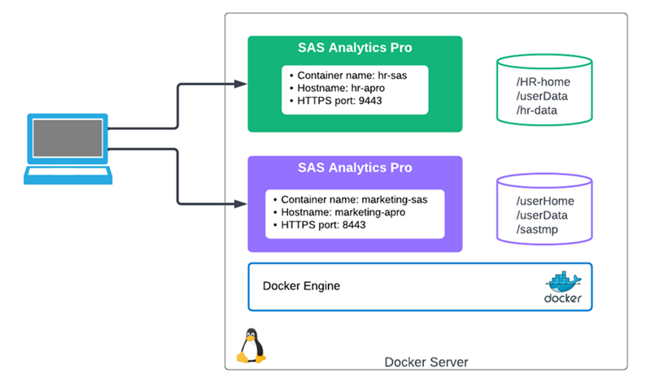
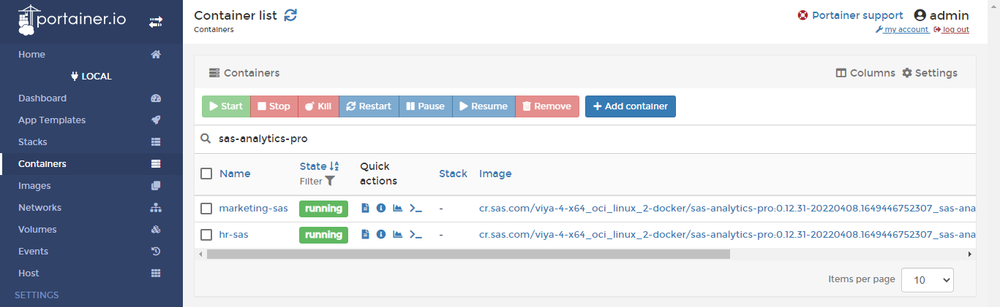
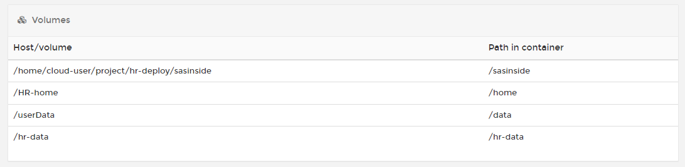
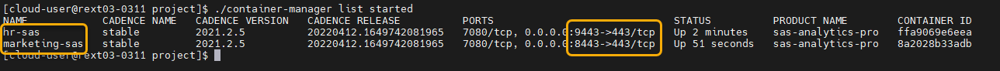
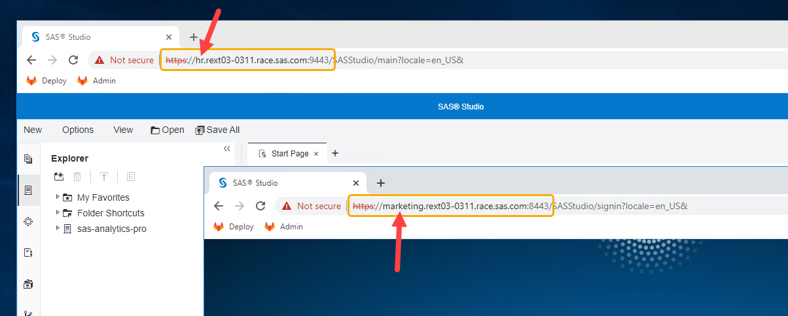
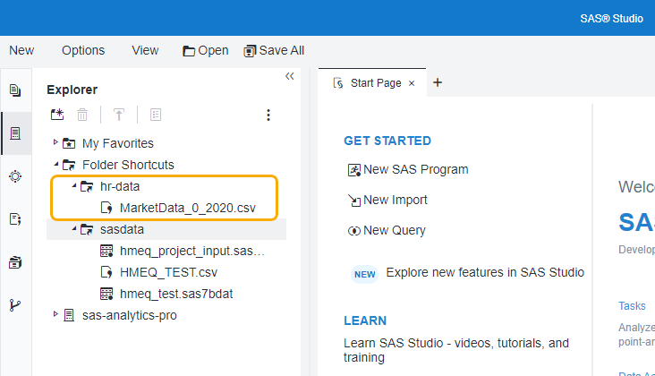

# Running Multiple Instances of SAS Analytics Pro

- [Running Multiple Instances of SAS Analytics Pro](#running-multiple-instances-of-sas-analytics-pro)
  - [Introduction](#introduction)
  - [Running multiple instances of a container](#running-multiple-instances-of-a-container)
    - [First, let's stop any existing deployment](#first-lets-stop-any-existing-deployment)
    - [Deploy the HR environment](#deploy-the-hr-environment)
    - [Deploy the Marketing environment](#deploy-the-marketing-environment)
  - [Validate the deployments](#validate-the-deployments)
  - [1. Logout when finished.](#1-logout-when-finished)
  - [Next steps](#next-steps)
  - [Hands-on Navigation Index](#hands-on-navigation-index)

## Introduction

This exercise will illustrate running multiple instances of SAS Analytics Pro on the server. An organization might do this to provide separate SAS environments for different business units, say HR and Marketing, or for a special project.

This exercise uses the configuration that you created in the previous lab exercise: [03_021 Advanced Analytics Pro configuration](./../03_Productionize_the_deployment/03_021_Advanced_AnalyticsPro_configuration.md).

## Running multiple instances of a container

Each instance of Analytics Pro needs to have a unique container name and the container must be exposed on a dedicated port (you can't share the ports across multiple containers).

For Analytics Pro, the Apache HTTP server proxy file (dkrapro-proxy.conf) in the image, has a default setting to allow incoming requests from port 8080 (for HTTP) and port 8443 (for HTTPS). **All other ports are blocked**.

Therefore, to enable access to SAS Studio on different ports the default setting(s) need to be changed. This is done through the following environment variables (passed on the 'docker run' command):

* docker run **-e STUDIO_HTTP_PORT=**"new-port-setting" -publish "new-port-setting":80
* docker run **-e STUDIO_HTTPS_PORT=**"new-port-setting" -publish "new-port-setting":443

For this exercise you will create two instances of Analytics Pro, one for the "HR" department and one instance for the "Marketing" department.

The configuration files could be shared, but a more likely scenario is that the environments would require a some differences. For example, the HR department might have sensitive data that needs to be protected, and access to the HR environment may also be restricted.

Use the following names and ports:

1. HR SAS environment.

    * Container name: '**hr-sas**'
    * hostname: '**hr-apro**'
    * HTTPS port: '**9443**'

1. Marketing SAS environment.

    * Container name: '**marketing-sas**'
    * hostname: '**marketing-apro**'
    * HTTPS port: '**8443**'



*Figure 1. Exercise overview*

### First, let's stop any existing deployment

1. Stop any running instances.

    ```bash
    # Stop any previous instance of Analytics Pro
    ## Get the container ID
    CONTAINER_ID=$(docker container ls | grep sas-analytics-pro | awk '{ print $1 }')
    ## Kill the running container
    docker container kill $CONTAINER_ID
    ```

### Deploy the HR environment

As suggested earlier, the HR department needs access to secure data. For this we will create a new data volume and you will have to add this to the allowed paths list. Also, the HR environment will NOT use the '/sastmp' storage that has been setup for SASWORK and UTILLOC.

The '**gatedemo200**' user will be setup as the HR user, and will have a separate '/home' location to the other users. This will have the added advantage of restricting access to Analytics Pro. Perhaps not a true production setup, but will work as an example.

1. Set-up the HR user and sample data

    ```bash
    # Create the HR user and data
    bash ~/PSGEL317-sas-analytics-pro-deployment-and-configuration/scripts/create_hr_user_and_data.sh
    ```

1. Copy the Analytics Pro configuration.

    We will use a separate folder for the HR configuration.

    ```bash
    mkdir -p ~/project/hr-deploy/sasinside/sasosconfig/
    # Copy license file
    cp -R ~/project/sasinside/*.jwt ~/project/hr-deploy/sasinside/
    # Get OS files
    cp -R ~/project/sasinside/sasosconfig/* ~/project/hr-deploy/sasinside/sasosconfig/
    ```

1. Create the `autoexec_usermods.sas` file and define the 'allowed paths'.

    The HR environment will have access to the sasdata (/data) and the '/hr-data/' path.

    ```bash
    cd ~/project/hr-deploy/
    cat << 'EOF' > ~/project/hr-deploy/sasinside/autoexec_usermods.sas
    * Update the list of accessible paths;
    LOCKDOWN PATH="/data";
    LOCKDOWN PATH="/hr-data";
    EOF
    ```

1. Start the HR instance of Analytics Pro.

    For this you will use a container name of '**hr-sas**' and port '**9443**'.

    While you could keep the 'hostname' as *sas-analytics-pro* it might be better to set a unique name. This will provide a differentiation when working with the container. Let's use '**hr-apro**' for the hostname.

    ```bash
    cd ~/project/hr-deploy/
    # Get the Analytics Pro image name
    APRO_IMAGE=$(docker image ls | grep -m 1 sas-analytics-pro | awk '{ print $1 ":" $2 }')

    # Start the HR instance
    docker run -u root \
      --name=hr-sas \
      --rm \
      --detach \
      --hostname hr-apro \
      --env SASLICENSEFILE=SASViyaV4_APro_license.jwt \
      --env SSL_CERT_NAME=casigned.crt \
      --env SSL_KEY_NAME=servertls.key \
      --env STUDIO_HTTPS_PORT="9443" \
      --publish 9443:443 \
      --volume ${PWD}/sasinside:/sasinside \
      --volume /HR-home:/home \
      --volume /userData:/data \
      --volume /hr-data:/hr-data \
      $APRO_IMAGE
    ```

### Deploy the Marketing environment

For the Marketing deployment you will use the existing configuration in the '~/project/sasinside' folder, but we will copy it to a new folder. You will use a container name of '**marketing-sas**', port '**8443**', and the hostname of '**marketing-apro**'.

As we will use port 8443, we do not have to use the environment variable to set the Studio port.

1. Create the new configuration folder.

    ```bash
    mkdir -p ~/project/marketing-deploy/sasinside/sasosconfig/

    # Copy the existing configuration
    cp -R ~/project/sasinside/* ~/project/marketing-deploy/sasinside/
    ```

1. Start the Marketing instance of Analytics Pro.

    ```bash
    cd ~/project/marketing-deploy/
    # Get the Analytics Pro image name
    APRO_IMAGE=$(docker image ls | grep -m 1 sas-analytics-pro | awk '{ print $1 ":" $2 }')

    docker run -u root \
      --name=marketing-sas \
      --rm \
      --detach \
      --hostname marketing-apro \
      --env SASLICENSEFILE=SASViyaV4_APro_license.jwt \
      --env SSL_CERT_NAME=casigned.crt \
      --env SSL_KEY_NAME=servertls.key \
      --publish 8443:443 \
      --volume ${PWD}/sasinside:/sasinside \
      --volume /userHome:/home \
      --volume /userData:/data \
      --volume /sastmp:/sastmp \
      $APRO_IMAGE
    ```

You should now have two instances of Analytics Pro running.

## Validate the deployments

To confirm that you have two instances of Analytics Pro running we can use the 'container-manager' or Portainer.

* Using Portainer you should see the following.

    

    If you look at the container volume mounts for 'hr-sas', you will see the new set-up. For example.

    

    As you can see, there is the new mount for the HR data and the new '/home' for the HR users. The environment also has access to all the other "business" data (/data).

1. Using Container Manager, run the following command.

    ```sh
    cd ~/project/
    ./container-manager list started
    ```

    You should see output similar to the following (for the cadence version being used).

    

1. Get the new URLs.

    As we are running in the RACE environment, and don't need to set-up DNS alias names for the two environments, you can use the following for access.

    * Get the SAS Studio URL for the HR environment.

        ```sh
        echo -e "\n HR SAS Studio URL(https): "https://hr.$(hostname -f):9443/SASStudio/
        ```

        You can login with the '**gatedemo200**' user.

    * Get the SAS Studio URL for the Marketing environment.

        ```sh
        echo -e "\n Marketing SAS Studio URL(https): "https://marketing.$(hostname -f):8443/SASStudio/
        ```

1. Login and test the Analytics Pro environments.

    The image below shows the two instances running.

    


1. Test access to the HR data.

    At this point you should only be able to login to the HR environment with the 'gatedemo200' user, the other users should fail. Try it with 'gatedemo001'. Likewise, the 'gatedemo200' user shouldn't work in the Marketing environment.

    Using 'gatedemo200' you should be able to create a 'Shortcut' to both the sasdate (/data) and HR data (/hr-data). The image below is for an HR deployment.

    

1. Logout when finished.
---

## Next steps

That completes the running multiple instances exercise. Now proceed to the next exercise.

  * [Using a CAS Server with SAS Analytics Pro](./../04_Using_a_CAS_server/04_011_Using_a_CAS_server.md)

---

## Hands-on Navigation Index

<!-- startnav -->
* [01 Workshop Introduction / 01 011 Access Environments](/01_Workshop_Introduction/01_011_Access_Environments.md)
* [02 Deploy AnalyticsPro / 02 011 Environment setup](/02_Deploy_AnalyticsPro/02_011_Environment_setup.md)
* [02 Deploy AnalyticsPro / 02 021 Quick start deployment of AnalyticsPro](/02_Deploy_AnalyticsPro/02_021_Quick-start_deployment_of_AnalyticsPro.md)
* [03 Productionize the deployment / 03 015 Configure authentication and TLS security](/03_Productionize_the_deployment/03_015_Configure_authentication_and_TLS_security.md)
* [03 Productionize the deployment / 03 025 Advanced AnalyticsPro configuration](/03_Productionize_the_deployment/03_025_Advanced_AnalyticsPro_configuration.md)
* [03 Productionize the deployment / 03 031 Running multiple instances](/03_Productionize_the_deployment/03_031_Running_multiple_instances.md)**<-- you are here**
* [04 Using a CAS server / 04 011 Using a CAS server](/04_Using_a_CAS_server/04_011_Using_a_CAS_server.md)
* [05 Using Python with APro / 05 015 Using Python with AnalyticsPro](/05_Using_Python_with_APro/05_015_Using_Python_with_AnalyticsPro.md)
* [README](/README.md)
<!-- endnav -->
