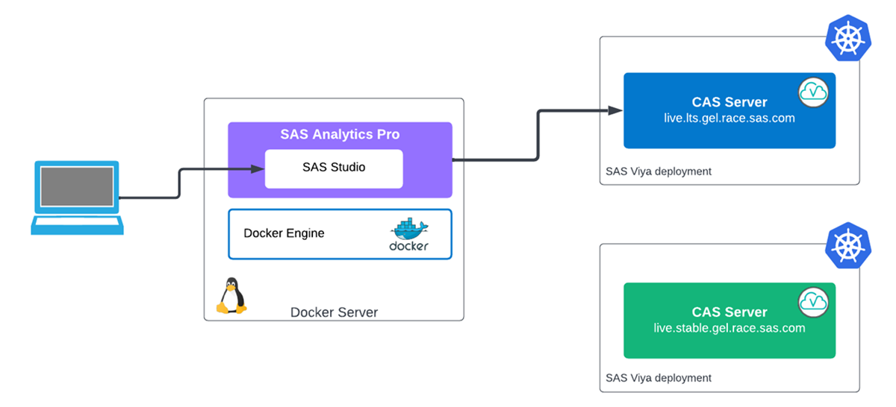
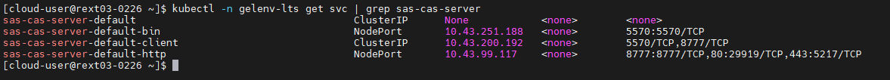
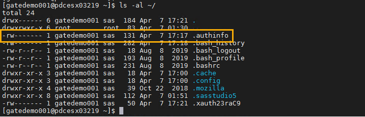
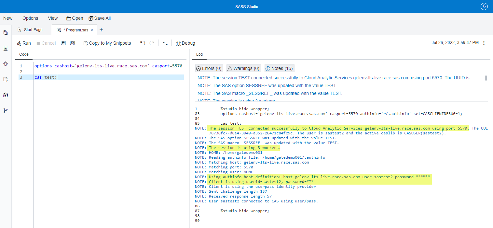
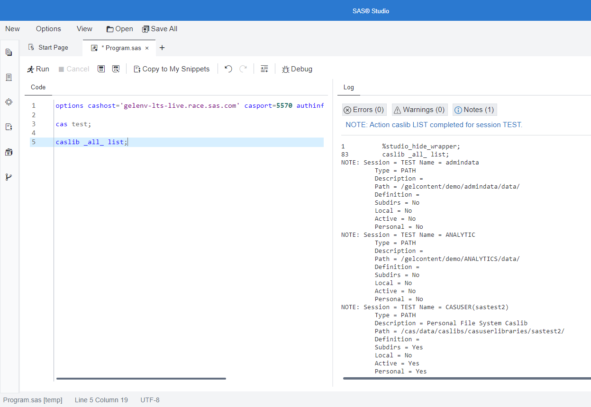

# Using a CAS Server with SAS Analytics Pro

- [Using a CAS Server with SAS Analytics Pro](#using-a-cas-server-with-sas-analytics-pro)
  - [Introduction](#introduction)
  - [Environment Set-up](#environment-set-up)
    - [Add the CAS certificate to the trusted certificates for Analytics Pro](#add-the-cas-certificate-to-the-trusted-certificates-for-analytics-pro)
    - [Create the user's .authinfo file](#create-the-users-authinfo-file)
      - [Automated Path](#automated-path)
      - [Manual Path](#manual-path)
  - [Connect to the CAS Server](#connect-to-the-cas-server)
  - [Scripting the start-up and configuration](#scripting-the-start-up-and-configuration)
  - [Next steps](#next-steps)
  - [Hands-on Navigation Index](#hands-on-navigation-index)

## Introduction

**For this we will use the "production" set-up from the previous lab exercises. Ensure you have completed [03_011_Configure_authentication_and_TLS_security](./../03_Productionize_the_deployment/03_011_Configure_authentication_and_TLS_security.md) and [03_021_Advanced_AnalyticsPro_configuration](./../03_Productionize_the_deployment/03_021_Advanced_AnalyticsPro_configuration.md).**

In this exercise we will configure Analytics Pro so that you can connect to a CAS Server running in a shared SAS Viya deployment. We call this a "shared collection", see the links below:

* [live.lts.gel.race.sas.com](https://live.lts.gel.race.sas.com/SASDrive/)
* As an alternate environment see: [live.stable.gel.race.sas.com](https://live.stable.gel.race.sas.com/SASDrive/)



*Figure 1. Exercise overview*

To connect to a CAS Server from Analytics Pro, Analytics Pro ***must*** trust the certificate being used by the CAS Server. To do this you must get the Viya CA certificate and include it in the Analytics Pro trusted certificates, in the '**trustedcerts.pem**' file. This file is located in the `/opt/sas/viya/config/etc/SASSecurityCertificateFramework/cacerts/` directory.

The steps to get the CA certificate are detailed in the SAS Viya Administration manual, see: [Obtain the SAS Viya Generated Root CA Certificate That Cert-Manager Is Configured to Use](https://go.documentation.sas.com/doc/en/sasadmincdc/v_025/calencryptmotion/n1xdqv1sezyrahn17erzcunxwix9.htm#n0309hwuyq56x2n17mkapfltqau6)

The following command can be used to retrieve the SAS Viya CA certificate value from the secret:

```sh
kubectl -n viya-namespace get secret sas-viya-ca-certificate-secret -o=jsonpath="{.data.ca\.crt}"|base64 -d
```

You can pipe the output of that command to a file, to save the certificate.

Along with the CA certificate, the SAS Viya platform needs to be configured to allow access to the CAS Server. For SAS Viya 4 you do this by including the `cas-enable-external-services.yaml`, which is added to the transformers section of the 'kustomization.yaml' file.

If the SAS Viya platform is running in the cloud, on one of the Cloud Provider platforms, using a Loadbalancer configuration is the recommended approach.

For instructions on how to implement this see the SAS Viya Administration manual, [Configure External Access to CAS](https://go.documentation.sas.com/doc/en/sasadmincdc/v_025/dplyml0phy0dkr/n08u2yg8tdkb4jn18u8zsi6yfv3d.htm#n0exq3y1b5gs73n18vi9o78y2dg3)

Finally, the following command can be used to get the port mappings for the CAS Server. You will need the port information for the '**sas-cas-server-default-bin**' port to connect to CAS.

```sh
kubectl -n viya-namespace get svc | grep sas-cas-server
```

For example:



*Note, the instructions above are for SAS Viya 4*.

## Environment Set-up

1. Get the certificate for connecting to the CAS server.

    As we are using one of the GEL shared collections for the SAS Viya (CAS) environment, the Viya platform is using the GEL CA certificate, we don't need to query the running Viya platform to get the Viya CA certificate.

    Use the following command to download the certificate.

    ```bash
    curl -sk https://gelgitlab.race.sas.com/GEL/utilities/gellow/-/raw/main/scripts/loop/viya4/gelenv/TLS/GELEnvRootCA/ca_cert.pem \
    -o  ~/project/assets/ca_cert.pem
    ```

1. Copy the certificate to the 'sasinside' folder to make it accessable to the Analytics Pro container.

    Including the certificate in the 'sasinside' folder will ensure that it is mounted to the Analytics Pro container.

    ```bash
    cp ~/project/assets/ca_cert.pem ~/project/sasinside/
    ```

    Now, to complete the setup you need a running instance of Analytics Pro.

1. Let's start a new instance of SAS Analytics Pro (just to ensure we are in a known state).

    * Remove any running instance.

        ```bash
        # Get the container ID
        CONTAINER_ID=$(docker container ls | grep sas-analytics-pro | awk '{ print $1 }')
        # Kill the running container
        docker container kill $CONTAINER_ID
        ```

    * Start a new instance of Analytics Pro.

        ```bash
        cd ~/project/
        # Get the Analytics Pro image name
        APRO_IMAGE=$(docker image ls | grep -m 1 sas-analytics-pro | awk '{ print $1 ":" $2 }')

        docker run -u root \
        --name=sas-analytics-pro \
        --rm \
        --detach \
        --hostname sas-analytics-pro \
        --env SASLICENSEFILE=SASViyaV4_APro_license.jwt \
        --env SSL_CERT_NAME=casigned.crt \
        --env SSL_KEY_NAME=servertls.key \
        --publish 8443:443 \
        --volume ${PWD}/sasinside:/sasinside \
        --volume /userHome:/home \
        --volume /userData:/data \
        --volume /sastmp:/sastmp \
        $APRO_IMAGE
        ```

### Add the CAS certificate to the trusted certificates for Analytics Pro

**Wait for Analytics Pro to start**. The following step has to be completed on a running Analytics Pro environment.

<!-- wait for cheatcodes
sleep 90s
-->

1. EXEC into the container to include the CAS certificate into the trusted certs.

    The GEL certificate needs to be appended to the 'trustedcerts.pem' file. Use the following command to do this.

    ```bash
    # Exec into the container and copy the file
    docker exec -u=root -it sas-analytics-pro bash \
    -c "cat /sasinside/ca_cert.pem >> /opt/sas/viya/config/etc/SASSecurityCertificateFramework/cacerts/trustedcerts.pem"
    ```

Typically you would do this once, but unless the container image is saved in it's current state the above step would have to be repeated each time a new instance of Analytics Pro is started.

However, we will not bother with that step here.

If you would like to view the contents of the 'trustedcerts.pem' file, run the following command.

* View the contents of the 'trustedcerts.pem' file.

    ```sh
    docker exec -u=root -it sas-analytics-pro bash \
    -c "cat /opt/sas/viya/config/etc/SASSecurityCertificateFramework/cacerts/trustedcerts.pem"
    ```

### Create the user's .authinfo file

When connecting to CAS we don't want the user credentials in clear text, we will store the credentials in the .authinfo file. The .authinfo file needs to be created for the user we will login to SAS Studio as, you will use '**gatedemo001**' for this exercise.

However, we will connect to the CAS Server using the 'SAS Test User 2' (**sastest2**) user.

In the steps below you can either create the authinfo file using the **Automated Path** or using the **Manual Path**.

#### Automated Path

* Run the following to create the 'authinfo' file.

    ```bash
    sudo mkdir /working/
    sudo chmod 777 /working/

    cp ~/PSGEL317-sas-analytics-pro-deployment-and-configuration/scripts/create_authinfo.sh /working/

    sudo runuser -u gatedemo001 bash /working/create_authinfo.sh
    ```

#### Manual Path

1. Switch to the 'gatedemo001 user to create the '.authinfo' file.

    ```sh
    # You will be prompted for the password.
    su gatedemo001
    ```

    **Password:** 'P@ssw0rd (with a zero)

1. Create the '.authinfo' file.

    ```sh
    # Create the authinfo file for the GEL shared environments
    cd ~/
    cat << 'EOF' > ~/.authinfo
    host gelenv-lts-live.race.sas.com user sastest2 password lnxsas
    host gelenv-stable-live.race.sas.com user sastest2 password lnxsas
    EOF
    ```

    As can be seen from the configuration above, we will use the 'sastest2' user to connect to the CAS Server. So, we will use the 'gatedemo001' user in Analytics Pro (SAS Studio), but connect to the CAS Server using 'sastest2'.

1. Set the permissions on the '.authinfo' file.

    The '.authiinfo'file must have Read and Write permissions only for the owner. Use chmod to change the permissions:

    ```sh
    chmod 600 ~/.authinfo
    ```

    *Note: It is a requirement that the authinfo file be in UTF8 encoding.*

1. Confirm that the permissions have been set.

    ```sh
    ls -al ~/
    ```

    You should see that the '.authinfo' file has the RW permissions set.

    

1. Exit from the 'gatedemo001' user.

    ```sh
    exit
    ```

This completes the set-up. Now let's test connecting to a CAS Server!

## Connect to the CAS Server

1. First, we need to get the current port information for the Shared Collections.

    Run the following command.

    ```bash
    bash ~/PSGEL317-sas-analytics-pro-deployment-and-configuration/scripts/get_port_numbers.sh
    ```

1. Export the port information.

    ```bash
    export LTS_PORT=$( cat ~/project/binary-ports.txt | grep lts-port | awk -F'::' '{print $2}' )
    export STABLE_PORT=$( cat ~/project/binary-ports.txt | grep stable-port | awk -F'::' '{print $2}' )
    ```

1. Login to SAS Studio with the '**gatedemo001**' user, the password is 'P@ssw0rd' (with a zero).

    Get the HTTPS URL for SAS Studio.

    ```sh
    cat ~/urls.md | grep "(https)"
    ```

1. Open a new program tab, click on '**New SAS Program**' from the Start Page.

1. Run the following to generate the statements to cut and paste into SAS Studio.

    ```sh
    printf "\n**** COPY THE FOLLOWING LINES ****\noptions cashost='gelenv-lts-live.race.sas.com' \
    casport="${LTS_PORT}" authinfo='~/.authinfo' set=CASCLIENTDEBUG=1;\n\ncas test;\n\
    **********************************\n\n"
    ```

1. Cut and paste the output from the last step (all the lines between the asters), and select **Run**.

    You should see the following output.

    

    Focusing on the three highlighted sections, you should see the following:

    * You have successfully started a session called 'TEST'.
    * The session is using 3 workers, and
    * Confirmation that the authinfo file has worked. You will see that the client user is '**sastest2**'.

    If that environment is unavailable try the following options statement:

    ```sh
    printf "\n**** COPY THE FOLLOWING LINES ****\noptions cashost='gelenv-stable-live.race.sas.com' \
    casport="${STABLE_PORT}" authinfo='~/.authinfo' set=CASCLIENTDEBUG=1;\n\ncas test2;\n\
    **********************************\n\n"
    ```

1. Now, run a cas action.

    Cut and paste the following command into SAS Studio, then **Run** the command.

    ```sh
    caslib _all_ list;
    ```

    The CASLIB statement with the LIST option and the _ALL_ option displays all of the caslibs that are available and the caslib settings for each one.

    You will see that there are a number of caslib definitons in the shared environment, the shared collection.

    You should see output similar to the following.

    

1. When you have finsihed logout of SAS Studio.

<!--
printf "\n\n****\n**** You need to create the authinfo file before running the code in SAS Studio\n****\n\n"
-->

## Scripting the start-up and configuration

As previously stated, you could save the docker image to capture the configuration update. But this would have to be repeated every time the SAS Analytics Pro image changed or you wanted to make another configuration change.

So, a better approach would be to script the start-up, including the configuration updates. Use the following steps to test this out.

1. Create a start-up script called `start-analytics-pro.sh`.

    Ensure you copy all the lines below.

    ```bash
    cd ~/project/
    cat << 'EOF' > ~/project/start-analytics-pro.sh
    #!/bin/bash
    # Script to start an instance of Analytics Pro with the Viya certificate loaded

    # Set APro instance name
    #apro_name=sas-analytics-pro

    # Test to see if there is a running container
    apro_instance=$(docker container ls | grep sas-analytics-pro )

    if [ -z "$apro_instance" ]; then
        printf "\n\nNothing to do.\n\n"
    else
        # Kill the running instance of APro
        printf "\n\nStopping the current Analytics Pro instance\n\n"
        container_id=$(docker container ls | grep sas-analytics-pro | awk '{ print $1 }')
        docker container kill $container_id
    fi

    # Start a new container
    cd ~/project/
    # Get the Analytics Pro image name
    APRO_IMAGE=$(docker image ls | grep -m 1 sas-analytics-pro | awk '{ print $1 ":" $2 }')

    docker run -u root \
    --name=sas-analytics-pro \
    --rm \
    --detach \
    --hostname sas-analytics-pro \
    --env SASLICENSEFILE=SASViyaV4_APro_license.jwt \
    --env SSL_CERT_NAME=casigned.crt \
    --env SSL_KEY_NAME=servertls.key \
    --publish 8443:443 \
    --volume ${PWD}/sasinside:/sasinside \
    --volume /userHome:/home \
    --volume /userData:/data \
    --volume /sastmp:/sastmp \
    $APRO_IMAGE

    # Wait for APro to start
    printf "\n\nWaiting for Analytics Pro to start\n"
    sleep 30s

    # Copy in the Viya certificate
    printf "\nInjecting the Viya certificate\n"
    docker exec -u=root -it sas-analytics-pro bash \
    -c "cat /sasinside/ca_cert.pem >> /opt/sas/viya/config/etc/SASSecurityCertificateFramework/cacerts/trustedcerts.pem"

    printf "\n\nAnalytics Pro is open for business\n\n"

    EOF
    ```

1. Set the execute permission on the start script.

    ```bash
    chmod +x ~/project/start-analytics-pro.sh
    ```

1. Test the script.

    Now use the script to start an instance of Analytics Pro. If you have a running instance, you should see the script stop the instance.

    ```sh
    ./start-analytics-pro.sh
    ```

1. Login to confirm that you can connect to the CAS Server.

    * Login to SAS Studio with the '**gatedemo001**' user, the password is 'P@ssw0rd' (with a zero).

        Get the HTTPS URL for SAS Studio.

        ```sh
        cat ~/urls.md | grep "(https)"
        ```

    * Open a new program tab, click on '**New SAS Program**' from the Start Page.

    * Run the following to generate the statements to cut and paste into SAS Studio.

        ```sh
        printf "\n**** COPY THE FOLLOWING LINES ****\noptions cashost='gelenv-lts-live.race.sas.com' \
        casport="${LTS_PORT}" authinfo='~/.authinfo' set=CASCLIENTDEBUG=1;\n\ncas test;\n\
        **********************************\n\n"
        ```

1. Logout once you are finished.

---

## Next steps

That completes the CAS Server exercise. Now proceed to next exercise.

  * [Using Python with SAS Analytics Pro](./../05_Using_Python_with_APro/README.md)

---

## Hands-on Navigation Index

<!-- startnav -->
* [01 Workshop Introduction / 01 011 Access Environments](/01_Workshop_Introduction/01_011_Access_Environments.md)
* [02 Deploy AnalyticsPro / 02 011 Environment setup](/02_Deploy_AnalyticsPro/02_011_Environment_setup.md)
* [02 Deploy AnalyticsPro / 02 021 Quick start deployment of AnalyticsPro](/02_Deploy_AnalyticsPro/02_021_Quick-start_deployment_of_AnalyticsPro.md)
* [03 Productionize the deployment / 03 015 Configure authentication and TLS security](/03_Productionize_the_deployment/03_015_Configure_authentication_and_TLS_security.md)
* [03 Productionize the deployment / 03 025 Advanced AnalyticsPro configuration](/03_Productionize_the_deployment/03_025_Advanced_AnalyticsPro_configuration.md)
* [03 Productionize the deployment / 03 031 Running multiple instances](/03_Productionize_the_deployment/03_031_Running_multiple_instances.md)
* [04 Using a CAS server / 04 011 Using a CAS server](/04_Using_a_CAS_server/04_011_Using_a_CAS_server.md)**<-- you are here**
* [05 Using Python with APro / 05 015 Using Python with AnalyticsPro](/05_Using_Python_with_APro/05_015_Using_Python_with_AnalyticsPro.md)
* [README](/README.md)
<!-- endnav -->
